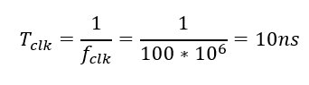
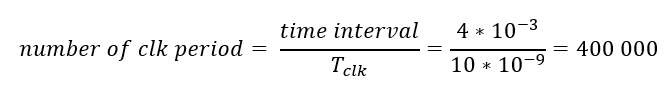

# Lab 5: David Pěčonka

## 1. Preparation

The Nexys A7 board provides five push buttons for user applications.

1. 

2. Calculate how many periods of clock signal with frequency of 100&nbsp;MHz contain time intervals 2&nbsp;ms, 4&nbsp;ms, 10&nbsp;ms, 250&nbsp;ms, 500&nbsp;ms, and 1&nbsp;s. Write values in decimal, binary, and hexadecimal forms.

   &nbsp;
   
   &nbsp;

   
   &nbsp;
   <!--
   https://editor.codecogs.com/
   T_{clk}=\frac{1}{f_{clk}}=
   \textup{number of clk period} = \frac{\textup{time interval}}{T_{clk}}=
   -->

   | **Time interval** | **Number of clk periods** | **Number of clk periods in hex** | **Number of clk periods in binary** |
   | :-: | :-: | :-: | :-: |
   | 2&nbsp;ms | 200 000 | `x"3_0d40"` | `b"0011_0000_1101_0100_0000"` |
   | 4&nbsp;ms | 400 000 | `x"6_1a80"` | `b"0110_0001_1010_1000_0000"` |
   | 10&nbsp;ms | 1 000 000 | `x"f_4240"` | `b"1111_0100_0010_0100_0000"` |
   | 250&nbsp;ms | 25 000 000 | `x"17_d7840"` | `b"0001_0111_1101_0111_1000_0100_0000"` |
   | 500&nbsp;ms | 50 000 000 | `x"2fa_f080"` | `b"0010_1111_1010_1111_0000_1000_0000"` |
   | 1&nbsp;sec | 100 000 000 | `x"5F5_E100"` | `b"0101_1111_0101_1110_0001_0000_0000"` |

